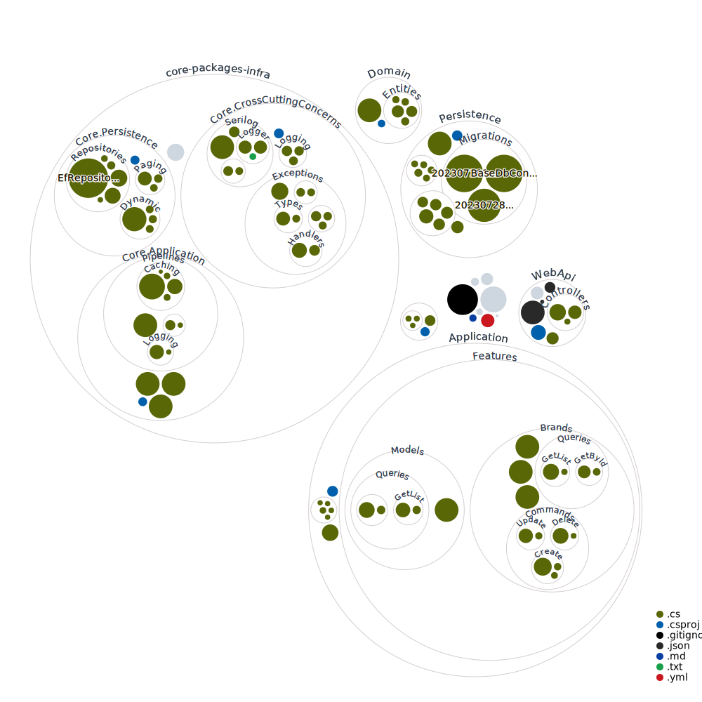

# CQRS-microservices
 * based on rent-a-car project of Engin Demiroğ. 
 * added deployment with docker-compose for caching with and changed database to postgres. 
 * added microservices implementation to CQRS architecture 
 * added RabbitMQ with mass transit for future services. 
 * updated infrastructure modules.
 * 
 
 
